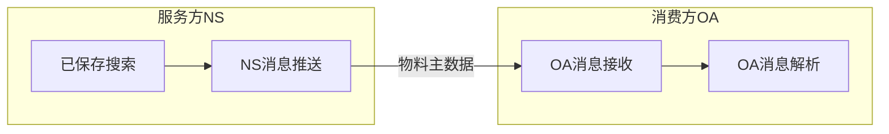

# SuiteScript 2.0开发实例 单向接口 物料主数据同步OA

## 1. 业务场景



## 2. 接口实现

### 2.1 接口逻辑设计

#### 2.1.1 增量推送

每次只推送基于上一次推送之后的增量数据

#### 2.1.2 字段取值逻辑

NS字段名称|NS字段ID|OA字段名称|OA字段ID
---|---|---|---
货品编码|item_id|物料编码|item_num


### 2.2 接口技术设计

#### 如何实现对同步接口的调度？

用Scheduled Script类型，此可以调用其他哪些脚本类型？

用Map/Reduce Script类型，此可以调用其他哪些脚本类型？

#### 增量比较

脚本参数，将上次取数时间写到脚本参数中

再将数据更新时间与脚本参数比较


#### 2.2.1 Suitelet实现接口服务

服务方：创建Suitelet发布服务暴露URL

消费方：获取URL解析响应JSON

#### 2.2.2 RESTlet实现接口服务


#### 2.2.3 WS实现


| **Attribute** | **RESTlets** | **Suitelets**  | **SuiteTalk** |
| --------------| -------------- | --------------- | --------------- |
| **Supported Operations** | get, search, add, update | get, search, add, update                                     | get, search, add, update (homogenous)                        |
| **Authentication   Supported?**         | Yes                                                          | No, when available without login and executed as admin programmatically<br>Yes,   when accessed from a browser by a logged-in NetSuite user | Yes                                                          |
| **Supported HTTP Methods**              | GET, PUT, POST, DELETE                                       |                                                              | POST                                                         |
| **Passing of Login Details**            | in authorization header                                      |                                                              | in body (SOAP)                                               |
| **Passing of Parameters**               | GET parameters on URL                                        |                                                              | all parameters in body (SOAP)                                |
| **Supported Content Types**             | JSON, text/xml (explicit)                                    |                                                              | text/xml (explicit)                                          |
| **Environment**                         | lightweight, more suitable for mobile devices, bundleable    |                                                              | heavy programming and deployment environment (C#, Java) |
| **Script   Functions and HTTP Methods** | individual   script function for each HTTP method            | one   script function for all HTTP method                    |       |
| **Content Handling**                    | built-in   handling of JSON input/ output                    | must   write code to convert JSON input/output               |                                                              |
| **Governance**                          | 5,000 usage units per script                               | 1,000 usage units per script                               |                                                              |
| **URL Clarity?**                        | Yes   https://rest.netsuite.com/app/   site/hosting/restlet.nl?script=57& deploy=1&   recordtype=salesorder&id=21480   (Note   that for clients hosted by NetSuite, use the relative URL that does not   include the domain.) | No   https://forms/netsuite.com/app/ site/hosting/scriptlet.nl?script=62&   deploy=1&compid=824056&h= ec041b59b3075bec783d | No https://webservices.netsuite.com/services/NetSuitePort_2011_1 |

## 附

### A Suitelet实现与HttpClient

#### A.1 Suitelet 发布主数据查询服务(ItemSyncInterface.js)

```java
/**
 * @NApiVersion 2.x
 * @NScriptType Suitelet
 * @NModuleScope SameAccount
 * @author YQ12681
 */
/////////////////////////物料主数据接口///////////////////////
//
// 输出一个text文件
//
//////////////////////////////////////////////////////////
define([ 'N/record', 'N/ui/serverWidget', 'N/search', 'N/file', 'N/runtime' ],
/**
 * @param {record} record
 * @param {serverWidget} serverWidget
 * @param {search} search
 * @param {file} file
 * @param {runtime} runtime
 */
function(record, serverWidget, search, file, runtime) {
	/**
	 * Definition of the Suitelet script trigger point.
	 * 
	 * @param {Object} context
	 * @param {ServerRequest} context.request - Encapsulation of the incoming request
	 * @param {ServerResponse} context.response - Encapsulation of the Suitelet response
	 * @Since 2015.2
	 */
	function onRequest(context) {
		//获取最后一次同步时间、是否增量同步参数

		var lastSyncDate = runtime.getCurrentScript().getParameter("custscript_itemsync_inf_last_update_date");
		var dataSyncType = runtime.getCurrentScript().getParameter("custscript_itemsync_inf_allorincrement");

		/*if (context.request.method == 'GET') {
			try {
				var form = serverWidget.createForm({ title : 'NS --> OA 物料主数据同步' });
				var submitButton = form.addSubmitButton({ label : '提交' });
				var outputField = form.addField({ id : 'custpage_output',
				label : '输出文本',
				type : serverWidget.FieldType.LONGTEXT });
				var flt = [];
				var itemRec = search.load({ id : 'customsearch_eai_mst_item_oa' }).run().getRange({ start : 0,
				end : 100 });
				var output = JSON.stringify(itemRec);
				outputField.setHelpText({ help : '该字段显示接口输出消息',
				showInlineForAssistant : true });
				outputField.defaultValue = output;
				context.response.writePage(form);

			} catch (err) {
				log.debug({ title : err.name,
				details : err.message });
			}
		} else {}*/

		//var itemRec = search.load({ id : 'customsearch_eai_mst_item_oa' }).run().getRange({ start : 0,
		//end : 100 });
		var itemRec = null;
		if (dataSyncType == '1') {
			itemRec = search.load({ id : 'customsearch_eai_mst_item_oa' }).run().getRange({ start : 0,
			end : 100 });
		} else if (dataSyncType == '2') {
			itemRec = search.creat({ type : 'item',
			filters : [ [ 'isinactive', search.Operator.EQUALTO, 'N' ], 'and', [ 'created', search.Operator.NOTLESSTHAN, Date().getDate() ] ],
			columns : [ 'internalid', 'displayname', 'category', 'purchaseunit', 'location', 'created' ]

			}).run();
		}
		var output = JSON.stringify(itemRec);
		var fileObj = file.create({ name : 'yq_ns_eai_oa_itemdata_output.txt',
		fileType : file.Type.PLAINTEXT,
		contents : output });

		/*fileObj.folder = -15;
		var fileId = fileObj.save();
		log.audit({ title : 'Id of new file record',
		details : fileId });
		*/
		context.response.writeFile({ file : fileObj,
		isInline : false });
	}

	return { onRequest : onRequest }
});
```

#### A.2 Java 实现对服务的调用(HttpClientNS.java)

```java
// HttpClientNS.java
package com.bansi.eai.consumer.util;

import java.io.UnsupportedEncodingException;
import java.util.HashMap;
import java.util.Map;

import javax.xml.bind.DatatypeConverter;

import com.alibaba.fastjson.JSON;
import com.alibaba.fastjson.JSONObject;

public class HttpClientNS {

	public static void main(String args[]) {
		String url = "https://forms.eu1.netsuite.com/app/site/hosting/scriptlet.nl?script=55&deploy=1&compid=5144758_SB1&h=7a7fa4443278bf5defc6";
		// 存储相关的header值
		Map<String, String> header = new HashMap<String, String>();
		// username:password--->访问的用户名，密码,并使用base64进行加密，将加密的字节信息转化为string类型，encoding--->token
		String encoding = null;
		try {
			encoding = DatatypeConverter.printBase64Binary("kermit:kermit".getBytes("UTF-8"));
		} catch (UnsupportedEncodingException e) {
			// TODO Auto-generated catch block
			e.printStackTrace();
		}
		header.put("Authorization", "Basic " + encoding);

		String response = HttpClientUtil.sendHttp(HttpRequestMethodEnum.HttpGet, url, null, header);
		// System.out.println(JSON.toJSONString(JSONObject.parseObject(response),
		// true));
		System.out.println(response);
	}
}

// HttpClientUtil.java
package com.bansi.eai.consumer.util;

import com.alibaba.fastjson.JSON;
import org.apache.http.HttpEntity;
import org.apache.http.HttpEntityEnclosingRequest;
import org.apache.http.client.config.RequestConfig;
import org.apache.http.client.methods.*;
import org.apache.http.entity.ContentType;
import org.apache.http.entity.StringEntity;
import org.apache.http.impl.client.CloseableHttpClient;
import org.apache.http.impl.client.HttpClients;
import org.apache.http.util.EntityUtils;

import java.io.IOException;
import java.util.Map;

/**
 * @author Bansi ZHU
 */
public class HttpClientUtil {

	/**
	 * httpclient使用步骤 
	 * 1、创建一个HttpClient对象;
	 * 2、创建一个Http请求对象并设置请求的URL，比如GET请求就创建一个HttpGet对象，POST请求就创建一个HttpPost对象;
	 * 3、如果需要可以设置请求对象的请求头参数，也可以往请求对象中添加请求参数; 
	 * 4、调用HttpClient对象的execute方法执行请求;
	 * 5、获取请求响应对象和响应Entity; 
	 * 6、从响应对象中获取响应状态，从响应Entity中获取响应内容; 
	 * 7、关闭响应对象;
	 * 8、关闭HttpClient.
	 */

	private static RequestConfig requestConfig = RequestConfig.custom()
			// 从连接池中获取连接的超时时间
			// 要用连接时尝试从连接池中获取，若是在等待了一定的时间后还没有获取到可用连接（比如连接池中没有空闲连接了）则会抛出获取连接超时异常。
			.setConnectionRequestTimeout(15000)
			// 与服务器连接超时时间：httpclient会创建一个异步线程用以创建socket连接，此处设置该socket的连接超时时间
			// 连接目标url的连接超时时间，即客服端发送请求到与目标url建立起连接的最大时间。超时时间3000ms过后，系统报出异常
			.setConnectTimeout(15000)
			// socket读数据超时时间：从服务器获取响应数据的超时时间
			// 连接上一个url后，获取response的返回等待时间
			// ，即在与目标url建立连接后，等待放回response的最大时间，在规定时间内没有返回响应的话就抛出SocketTimeout。
			.setSocketTimeout(15000).build();

	/**
	 * 发送http请求
	 *
	 * @param requestMethod
	 *            请求方式（HttpGet、HttpPost、HttpPut、HttpDelete）
	 * @param url
	 *            请求路径
	 * @param params
	 *            post请求参数
	 * @param header
	 *            请求头
	 * @return 响应文本
	 */
	public static String sendHttp(HttpRequestMethodEnum requestMethod, String url, Map<String, Object> params, Map<String, String> header) {
		// 1、创建一个HttpClient对象;
		CloseableHttpClient httpClient = HttpClients.createDefault();
		CloseableHttpResponse httpResponse = null;
		String responseContent = null;
		// 2、创建一个Http请求对象并设置请求的URL，比如GET请求就创建一个HttpGet对象，POST请求就创建一个HttpPost对象;
		HttpRequestBase request = requestMethod.createRequest(url);
		request.setConfig(requestConfig);
		// 3、如果需要可以设置请求对象的请求头参数，也可以往请求对象中添加请求参数;
		if (header != null) {
			for (Map.Entry<String, String> entry : header.entrySet()) {
				request.setHeader(entry.getKey(), entry.getValue());
			}
		}
		// 往对象中添加相关参数
		try {
			if (params != null) {
				((HttpEntityEnclosingRequest) request).setEntity(new StringEntity(JSON.toJSONString(params), ContentType.create("application/json", "UTF-8")));
			}
			// 4、调用HttpClient对象的execute方法执行请求;
			httpResponse = httpClient.execute(request);
			// 5、获取请求响应对象和响应Entity;
			HttpEntity httpEntity = httpResponse.getEntity();
			// 6、从响应对象中获取响应状态，从响应Entity中获取响应内容;
			if (httpEntity != null) {
				responseContent = EntityUtils.toString(httpEntity, "UTF-8");
			}
		} catch (IOException e) {
			e.printStackTrace();
		} finally {
			try {
				// 7、关闭响应对象;
				if (httpResponse != null) {
					httpResponse.close();
				}
				// 8、关闭HttpClient.
				if (httpClient != null) {
					httpClient.close();
				}
			} catch (IOException e) {
				e.printStackTrace();
			}
		}
		return responseContent;
	}
}
// HttpRequestMethodEnum.java
package com.bansi.eai.consumer.util;

import org.apache.http.client.methods.*;


/**
 * @author Bansi ZHU
 */
public enum HttpRequestMethodEnum {
	// HttpGet请求
	HttpGet {
		@Override
		public HttpRequestBase createRequest(String url) {
			return new HttpGet(url);
		}
	},
	// HttpPost 请求
	HttpPost {
		@Override
		public HttpRequestBase createRequest(String url) {
			return new HttpPost(url);
		}
	},
	// HttpPut 请求
	HttpPut {
		@Override
		public HttpRequestBase createRequest(String url) {
			return new HttpPut(url);
		}
	},
	// HttpDelete 请求
	HttpDelete {
		@Override
		public HttpRequestBase createRequest(String url) {
			return new HttpDelete(url);
		}
	};

	public HttpRequestBase createRequest(String url) {
		return null;
	}
}
```

#### A.3 Java客户端实现依赖的jar包

下载地址[https://mvnrepository.com/]


### B RESTlet实现


### C SuiteTalk实现