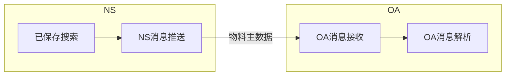

# SuiteScript 2.0开发实例 单向接口 物料主数据同步OA

## 1. 业务场景

## 2. 接口实现

### 2.1 接口逻辑设计

#### 2.1.1 增量推送

每次只推送基于上一次推送之后的增量数据

#### 2.1.2 字段取值逻辑

NS字段名称|NS字段ID|OA字段名称|OA字段ID
---|---|---|---
货品编码|item_id|物料编码|item_num

### 2.2 接口技术设计

#### 如何实现对同步接口的调度？

用Scheduled Script类型，此可以调用其他哪些脚本类型？

用Map/Reduce Script类型，此可以调用其他哪些脚本类型？

#### 增量比较

脚本参数，将上次取数时间写到脚本参数中

再将数据更新时间与脚本参数比较

#### 2.2.1 Suitelet实现

#### 2.2.2 RESTlet实现

#### 2.2.3 WS实现

| **Attribute** | **RESTlets** | **Suitelets**  | **SuiteTalk** |
| --------------| -------------- | --------------- | --------------- |
| **Supported Operations** | get, search, add, update | get, search, add, update                                     | get, search, add, update (homogenous)                        |
| **Authentication   Supported?**         | Yes                                                          | No, when available without login and executed as admin programmatically Yes,   when accessed from a browser by a logged-in NetSuite user | Yes                                                          |
| **Supported HTTP Methods**              | GET, PUT, POST, DELETE                                       |                                                              | POST                                                         |
| **Passing of Login Details**            | in authorization header                                      |                                                              | in body (SOAP)                                               |
| **Passing of Parameters**               | GET parameters on URL                                        |                                                              | all parameters in body (SOAP)                                |
| **Supported Content Types**             | JSON, text/xml (explicit)                                    |                                                              | text/xml (explicit)                                          |
| **Environment**                         | lightweight, more suitable for mobile devices, bundleable    |                                                              | heavy programming and deployment environment (C#, Java) |
| **Script   Functions and HTTP Methods** | individual   script function for each HTTP method            | one   script function for all HTTP method                    |       |
| **Content Handling**                    | built-in   handling of JSON input/ output                    | must   write code to convert JSON input/output               |                                                              |
| **Governance**                          | 5,000 usage units per script                               | 1,000 usage units per script                               |                                                              |
| **URL Clarity?**                        | Yes   https://rest.netsuite.com/app/   site/hosting/restlet.nl?script=57& deploy=1&   recordtype=salesorder&id=21480   (Note   that for clients hosted by NetSuite, use the relative URL that does not   include the domain.) | No   https://forms/netsuite.com/app/ site/hosting/scriptlet.nl?script=62&   deploy=1&compid=824056&h= ec041b59b3075bec783d | No https://webservices.netsuite.com/services/NetSuitePort_2011_1 |

